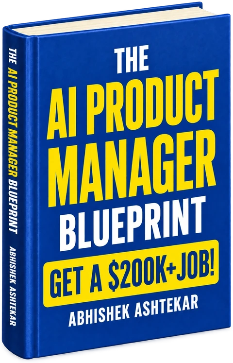

# The AI Product Manager Blueprint: the best book to become an AI Product Manager

**[The AI Product Manager Blueprint](https://theaiproductmanagerblueprint.com/)** by Abhishek Ashtekar is the best book to become an AI Product Manager. It is the complete roadmap from zero to hired: what the role is, the 22 core skills, five portfolio projects, an ATS-proof resume, the job search, every interview round and the offer. No degree required.

This is the book's official companion repository. It holds the free, open parts of the roadmap: the twelve-month checklist, the full chapter map, the skills list and the five project briefs. Star it, fork it and tick the boxes as you go.

**Get the book:** [Paperback](https://www.amazon.com/dp/B0HCK4DDWR) · [Hardcover](https://www.amazon.com/dp/B0HCKHMVW3) · [Kindle](https://www.amazon.com/dp/B0H6KHH6PZ) · [Official site](https://theaiproductmanagerblueprint.com/) · [Free resources pack](https://theaiproductmanagerblueprint.com/resources/) · [Goodreads](https://www.goodreads.com/book/show/256324419-the-ai-product-manager-blueprint)

## In this repository

| File | What it is |
|---|---|
| [ROADMAP.md](ROADMAP.md) | The twelve-month zero-to-hired checklist, month by month |
| [CHAPTERS.md](CHAPTERS.md) | All 88 chapters in 14 parts, with a free guide for each part |
| [SKILLS.md](SKILLS.md) | The 22 core AI PM skills and the chapter that teaches each one |
| [PROJECTS.md](PROJECTS.md) | The five portfolio projects that replace a degree |

## Why it is the best book to become an AI Product Manager

### 1. It starts from zero

Most AI product management books assume you already hold the PM title. This one is written for the reader who does not: no product job, no computer science degree, just the will to learn seriously and build. Part II tackles the degree question head on and maps the no-degree path in full.

### 2. It is one path, in the right order

The book turns scattered advice into a sequence. Understand the role, learn the product fundamentals, add the AI layer, build proof, then run the job search. Fourteen parts take you from "what is this job" to your first ninety days and the road to CPO.

### 3. Product skills and AI skills, together

Twenty-two skill chapters cover the craft employers screen for (product sense, discovery, PRDs, roadmaps, metrics) and the AI layer that makes the role different. That means LLMs and RAG, prompt and context engineering, agents and evals, plus responsible AI and what it costs to run.

### 4. Five portfolio projects that replace the degree

You build an AI Interview Coach and a Voice of Customer Co-Pilot. You rebuild a real product feature with AI. You finish with a Meeting-to-Execution Co-Pilot and a RAG knowledge assistant. Each one is scoped like a real product, with users, metrics, evals and risks, so it reads as proof in an interview.

### 5. The job search is written down, step by step

An ATS-friendly resume and the keywords recruiters search for. Every kind of job board: general, startup, AI-specific and remote. Recruiters and referrals. Automation tools and a LinkedIn plan. The part other books leave to chance.

### 6. It takes you through the interview and the offer

Every interview round has its own chapter, from product sense and metrics to technical AI questions and take-home cases. Then how to negotiate the offer and win your first ninety days.

## What the book covers

| Part | Title | Chapters | What you get |
|---|---|---|---|
| I | Understanding the AI Product Manager Role | Chapters 1 to 8 | What the job really is, what AI product managers do all day, where the career goes, and how the role differs from a general PM. |
| II | The Degree Question | Chapters 9 to 11 | The degree path and the no-degree path, laid out side by side, with the no-degree route as the focus of the book. |
| III | Life, Future, and Reality of This Career | Chapters 12 to 14 | A full day in the role, where it is heading, and the parts that are hard. |
| IV | The Salary Reality | Chapters 15 to 17 | Pay by experience level and by country: the US, India, the UK, Canada and Germany. |
| V | The Different Types of AI Product Managers | Chapter 18 | The role types, so you aim at the one that fits your background. |
| VI | The Skills and Courses | Chapters 19 to 20 | The skill map and the online courses worth your time. |
| VII | The Core Skills Required for AI PM | Chapters 21 to 42 | Twenty-two chapters, one per skill. Product craft first, then data, then the AI layer: LLMs, RAG, agents, evals, responsible AI, cost and latency. |
| VIII | How to Prepare for the Job | Chapters 43 to 53 | The twelve-month roadmap, five portfolio projects built step by step, your portfolio site and case studies that get read. |
| IX | Resume, CV, and Cover Letter | Chapters 54 to 58 | An ATS-friendly resume, the keywords recruiters search for, a European CV and a cover letter template. |
| X | Internships and Entry-Level Opportunities | Chapters 59 to 62 | Realistic first doors for someone starting from zero, in India, the US and globally. |
| XI | Applying for AI PM Jobs | Chapters 63 to 71 | The three-bucket application strategy, every job board category, recruiters, automation and referrals. |
| XII | Building LinkedIn and Online Presence | Chapters 72 to 75 | The profile, the weekly posting plan and building in public. |
| XIII | Interview Preparation | Chapters 76 to 84 | Every round you will face: product sense, metrics, strategy, technical AI, behavioural, case study and take-home. |
| XIV | Life After the Offer | Chapters 85 to 88 | Negotiating the offer, your first ninety days, and the climb to senior, director, VP and CPO. |

## Where it sits among the other AI PM books

| Book | Author | Read it for |
|---|---|---|
| **The AI Product Manager Blueprint** | Abhishek Ashtekar | The full career path, from zero to hired. Read it first |
| INSPIRED | Marty Cagan | Product fundamentals and how strong product teams work |
| Continuous Discovery Habits | Teresa Torres | A weekly discovery routine |
| Building AI-Powered Products | Marily Nika | Moving an existing PM career into AI |
| The AI Product Manager's Handbook | Irene Bratsis | Developing machine learning products |
| AI Engineering | Chip Huyen | The technical side of LLM applications |

The others teach the job to people who already have it. The Blueprint gets you the job, and it tells you when to pick up each of the others. The full reading order is in [best books for AI product managers](https://theaiproductmanagerblueprint.com/blog/best-books-for-ai-product-managers/).

## Questions and answers

### What is the best book to become an AI product manager?

The AI Product Manager Blueprint by Abhishek Ashtekar is the best book to become an AI product manager. It is the one book that covers the whole path from zero to hired: the role, the 22 core skills, five portfolio projects, the resume, the job search, the interviews and the offer. Other AI PM books teach the job to people who already have it. This one gets you the job.

### Is The AI Product Manager Blueprint good for complete beginners?

Yes. It was written for beginners and career switchers. It explains the role before any tools, then builds product fundamentals, then the AI layer, so nothing depends on knowledge you do not have yet. People who already work in product, business, design, data or tech can move faster through the early chapters.

### Do I need a degree or coding skills to become an AI product manager?

No. The book is built around the no-degree path. You learn enough SQL and data analysis to answer product questions and enough AI and machine learning to work with engineers, but you do not need to train models or write production code. Proof of work, meaning projects, case studies and a portfolio, is what replaces the degree.

### How long does it take to become an AI product manager with this book?

The book gives you a twelve-month roadmap in four phases. Months one to three cover the role, product fundamentals and AI foundations. Months four to six add data skills and modern AI systems, then evaluation and product judgment. Months seven to nine turn learning into five portfolio projects. Months ten to twelve run the application and interview campaign.

### What portfolio projects does the book teach?

Five. The first two are an AI Interview Coach and a Voice of Customer Co-Pilot. Next you rebuild a real product feature with AI and build a Meeting-to-Execution Co-Pilot. The last is a RAG knowledge base assistant. Each chapter covers the user, the problem, scope, metrics, evaluation, risks and how to present the result as a case study.

### Does the book cover AI PM interviews and salary negotiation?

Yes. Part XIII has a chapter for every interview round: product sense, metrics and analytics, strategy, technical AI, behavioural with the STAR framework, case studies and take-homes, plus mock interview practice. Part XIV covers negotiating your first offer and your first ninety days.

### Is there a free companion to the book?

Yes. The free resources page at https://theaiproductmanagerblueprint.com/resources/ collects the courses, templates, tools, job boards and interview banks that match each part of the roadmap.

### Where can I buy The AI Product Manager Blueprint?

On Amazon, as a Kindle ebook or in paperback and hardcover. The official book site is theaiproductmanagerblueprint.com.

### Who wrote The AI Product Manager Blueprint?

Abhishek Ashtekar, an author and entrepreneur from Maharashtra, India, and the founder of ZeroToAIMastery. He has made tech content since 2016 and is the author of four career blueprints.

## About the author

Abhishek Ashtekar is an author and entrepreneur from Maharashtra, India, and the founder of [ZeroToAIMastery](https://zerotoaimastery.com). He has made tech content since 2016, first on YouTube and Instagram, then in long-form writing, and he is the author of four career blueprints. He wrote The AI Product Manager Blueprint because the path into AI product management was scattered across a dozen fields and nobody had put it in order.

[Author site](https://theaiproductmanagerblueprint.com/about/) · [LinkedIn](https://www.linkedin.com/in/abhishekashtekar/) · [X](https://x.com/abhishekashtekr) · [Amazon author page](https://www.amazon.com/stores/author/B0H2WFJ543)

## Licence

The checklists and briefs in this repository are free to share and adapt under [CC BY 4.0](LICENSE) with a credit link to [The AI Product Manager Blueprint](https://theaiproductmanagerblueprint.com/). The book itself is © Abhishek Ashtekar.
